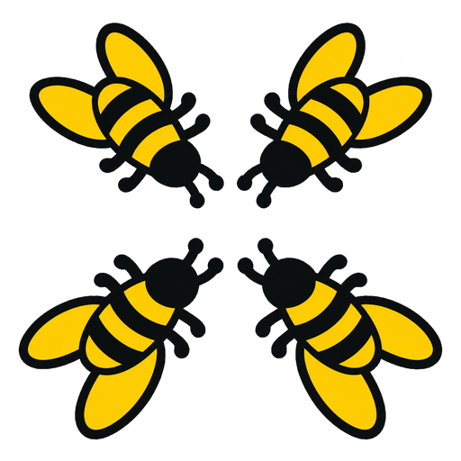
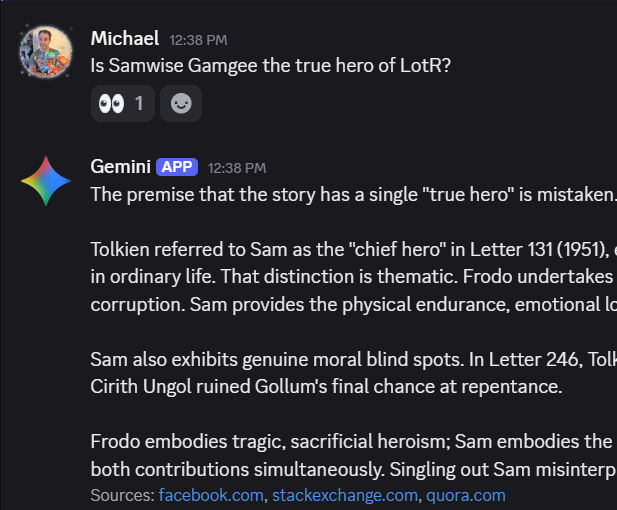

# waggle-dance



Asking one AI model gets you one take. Getting four usually means four browser tabs, four subscriptions, and a lot of copying and pasting, and the models never see each other's answers. waggle-dance does that legwork: post a question once and you get four independent answers, then a discussion in which each model checks, builds on, or disagrees with the others. Where they split, you learn which parts of the question are actually contested.

waggle-dance is a Discord bot that puts Claude, ChatGPT, Gemini, and Muse Spark in one channel to discuss whatever you want to post about. You type a message, each model answers, and they respond to each other's points as you follow up. When you are done, one model writes up where they agree and disagree, and the transcript is saved as Markdown and PDF.

The name comes from honeybee scouts, which choose a new nest site by debating with waggle dances until a quorum agrees.

It lives in Discord because not everyone likes iMessage or endless email threads. A Discord channel keeps the whole conversation in one scrollable place, shows who said what, and works the same on a phone or a desktop.

It is built for one person or a small group in their own Discord server. Every model call costs the owner money, so only the Discord users you list can use it.

<p align="center">
  
</p>

---

## How it works

- Everything happens in one Discord channel, as ordinary messages. Each model posts under its own name and avatar through a webhook.
- A plain message in the channel starts a conversation when none is open. Attach a `.txt`, `.md`, or `.pdf` file to that first message to include it.
- Later plain messages are follow-ups. Every model replies to each one in turn, and each sees the replies posted before its own.
- In the opening round, the models answer without seeing each other, so no model anchors on another's first take.
- Web search is on for every model, and models cite sources for specific facts.
- The bot reacts with 👀 when it records your message. A message sent while the models are still replying is held and answered when they finish. ⏳ means the conversation was closing and the message was not recorded.
- One conversation is open at a time. It closes when you run `/close` or `/summarize`, when you start a new one, or after 24 hours without activity.

### Files, long text, and links

> [!IMPORTANT]
> **The bot reads files only on the first message of a conversation.** A file dragged into the channel or attached to a follow-up is ignored. If the follow-up has no text, it is dropped without a 👀, so nothing happens and nothing tells you why.

- **Long pastes become files.** Discord turns any paste over 2,000 characters (4,000 with Nitro) into a `message.txt` attachment with no message text. Pasted into an open conversation, it is ignored like any other file. To discuss a long document, run `/new` first, then paste or drag it in as the first message.
- **Only `.txt`, `.md`, and `.pdf` files are read.** Add a line of text to the same message to say what you want the models to do with the file.
- **A plain message does not open links.** The models only see what web search finds, which may not include a page that is new, private, or behind a login. To have the bot read a page and give its text to every model, use `/review url`.

---

## Requirements

- Docker and Docker Compose
- A Discord server where you can add bots
- API keys for Anthropic, OpenAI, Google Gemini, and Meta (Muse Spark). You can turn off any model you do not have a key for.

Python is not required on the host. Everything runs in the container.

Fair warning: setup is mostly paperwork. You will collect a Discord bot token, three kinds of Discord IDs, and API keys from four companies, each with its own console, its own billing page, and its own opinion about where the "Create key" button belongs. Set aside half an hour and some patience. You only have to do it once, and after that the bees do the arguing.

---

## 1. Create the Discord bot

1. Go to [https://discord.com/developers/applications](https://discord.com/developers/applications).
2. Click **New Application** and name it (for example "waggle-dance").
3. Open the **Bot** tab.
4. Click **Reset Token** and copy the token. You need it in step 5.
5. Under **Privileged Gateway Intents**, turn on **Message Content Intent**.

   **This is required.** Without it the bot receives your messages with empty text and cannot start or follow up on conversations. Slash commands still work, which makes the problem easy to miss.

---

## 2. Invite the bot to your server

1. In the Developer Portal, open your application and go to **OAuth2 → URL Generator**.
2. Under **Scopes**, select `bot` and `applications.commands`. Both are required.
3. Under **Bot Permissions**, select:
   - View Channels
   - Send Messages
   - Read Message History
   - Add Reactions *(the 👀 and ⏳ reactions)*
   - Attach Files *(transcripts and long submissions)*
   - Manage Webhooks *(each model posts through a webhook under its own name)*
   - Use Application Commands
4. Open the generated URL in a browser and add the bot to your server.

---

## 3. Get the Discord IDs

In Discord, go to **User Settings → Advanced** and turn on **Developer Mode**. Then:

1. Right-click your server icon and choose **Copy Server ID**.
2. Create a text channel for the bot (for example `#waggle-dance`), right-click it, and choose **Copy Channel ID**.
3. Right-click your own name and choose **Copy User ID**. Do the same for anyone else who should be able to use the bot.

---

## 4. Get the API keys

| Model | Where to get a key | `.env` variable |
|---|---|---|
| Claude | [platform.claude.com](https://platform.claude.com) | `ANTHROPIC_API_KEY` |
| ChatGPT | [platform.openai.com](https://platform.openai.com) | `OPENAI_API_KEY` |
| Gemini | [aistudio.google.com](https://aistudio.google.com) | `GEMINI_API_KEY` |
| Muse Spark | [dev.meta.ai](https://dev.meta.ai) | `META_API_KEY` |

Each vendor will want a payment method before it hands over a key. This is the point where the bees start costing money.

Set a monthly spending limit in each vendor's console. The bot estimates costs, but only the vendors' limits actually stop spending.

To run without a model, set `enabled: false` for it in `config/models.yaml` (see step 6) and leave its key empty.

---

## 5. Clone and configure

```bash
git clone https://github.com/cruftbox/waggle-dance.git
cd waggle-dance
cp .env.example .env
```

Open `.env` and fill in the values:

```env
DISCORD_TOKEN=your-bot-token
DISCORD_GUILD_ID=your-server-id
DISCORD_CHANNEL_ID=your-channel-id
ALLOWED_USER_IDS=your-user-id
OWNER_NAME=YourName
ANTHROPIC_API_KEY=...
OPENAI_API_KEY=...
GEMINI_API_KEY=...
META_API_KEY=...
APP_UID=1000
APP_GID=1000
TZ=America/Los_Angeles
```

`APP_UID` and `APP_GID` should match the owner of the project directory on the host (run `id` to see yours). The container writes to `data/`, `config/`, and `instructions/`, which are mounted from the host.

Every variable is described in [docs/CONFIG.md](docs/CONFIG.md).

---

## 6. Start waggle-dance

```bash
docker compose up -d --build
docker compose logs -f
```

On first start the bot copies `config/models.example.yaml` to `config/models.yaml` and `instructions/shared.example.md` to `instructions/shared.md`. Edit those copies to change models, prices, reply length, or the instructions every model gets, then run `/reload` in Discord.

When the log shows `Ready as ... in #your-channel`, type a message in the channel.

To try the bot without API costs, set `MOCK_MODELS=1` in `.env` and run `docker compose up -d`. The models then return canned replies.

To check that every API key and model ID works (a real call to each model, a few cents in total):

```bash
docker compose exec waggle-dance python scripts/smoke_models.py
```

### Updating

```bash
git pull
docker compose up -d --build
```

After editing `.env`, run `docker compose up -d`. A plain `docker compose restart` does not reread `.env`.

---

## Commands

| Command | What it does |
|---|---|
| *(plain message)* | Starts a conversation, or follows up on the open one |
| `/new [topic]` | Closes the open conversation and starts fresh, optionally on a topic |
| `/review url [context]` | Starts a review of a blog or social media post. The bot reads the post and up to 5 pages it links to. `context` is the audience, platform, or feedback you want |
| `/disagree` | One model lists only the points of disagreement |
| `/vote` | Each model ranks the positions or proposed edits; the bot tallies a Borda count |
| `/consensus [summarizer]` | One model writes the outcome: key points, agreement, disagreement, and an answer. For a review, a merged edit list |
| `/cost` | Estimated tokens, searches, and dollars for this conversation (private) |
| `/export` | Attaches the transcript as Markdown and PDF |
| `/close` | Closes the conversation without posting anything. The transcript is still saved |
| `/summarize` | One model writes a consensus, then the conversation closes and the transcript is attached |
| `/models` | Lists enabled models and their model IDs (private) |
| `/instructions [model]` | Shows the full system prompt a model receives (private) |
| `/reload` | Rereads `config/models.yaml` and the instruction files |
| `/help` | How to use waggle-dance (private) |

`/disagree`, `/vote`, `/consensus`, and `/summarize` rotate which model does the writing. `/consensus` lets you pick one instead.

If another bot in your server also has a `/help` command, Discord lists both. Pick the entry labeled waggle-dance, or hide the other bot's commands in this channel under **Server Settings → Integrations**.

---

## Transcripts

Every closed conversation is saved to `data/exports/` as a Markdown file and a PDF, named with the conversation ID and title. `/export` attaches the same two files at any time, and `/summarize` attaches them when it closes. Emoji are left out of the PDF because its font has none.

Conversations, messages, and usage are stored in `data/waggle.db` (SQLite). An open conversation survives a restart. A follow-up that is waiting for the models to finish does not.

---

## Costs

These are estimates from real use with the default models, not quotes. Your costs depend on the models you configure, how long the conversation runs, and how much the models search.

| Conversation | Typical estimated cost |
|---|---|
| Opening round only | $0.03 to $0.10 |
| 1 to 5 follow-ups | $0.10 to $1.00 |
| 7 to 14 follow-ups | $1.00 to $3.60 |

Each round costs more than the last, because every model rereads the whole conversation. Long attachments and `/review` posts with many linked pages raise the cost of every call. Search counts vary widely: in one opening round a single Gemini call ran 45 searches, about $0.65, and the round cost $0.88.

That is still cheaper than a panel of human experts, and these ones never talk over each other.

`/cost` shows the running estimate. The bot posts a warning when a conversation's estimated spend would pass `session_cost_warning` in `config/models.yaml` ($5 by default). Estimates come from the token counts the APIs report and the prices in `models.yaml`, so keep those prices current. See [docs/PROVIDERS.md](docs/PROVIDERS.md).

---

## Security

- Every command and message costs the owner money. Only users in `ALLOWED_USER_IDS` can use the bot; it ignores everyone else's messages and refuses their commands.
- The bot only acts in `DISCORD_CHANNEL_ID`.
- Set spending limits with each API vendor.
- Keep `.env` out of version control. It is in `.gitignore`.
- Messages from every allowed user appear to the models under `OWNER_NAME`.

---

## More documentation

- [docs/CONFIG.md](docs/CONFIG.md): every setting, instruction files, switching models, and adding a provider
- [docs/ARCHITECTURE.md](docs/ARCHITECTURE.md): how a conversation runs inside the bot
- [docs/PROVIDERS.md](docs/PROVIDERS.md): each vendor's API, prices, and quirks
- [CHANGELOG.md](CHANGELOG.md)

---

## License

MIT. See [LICENSE](LICENSE).
